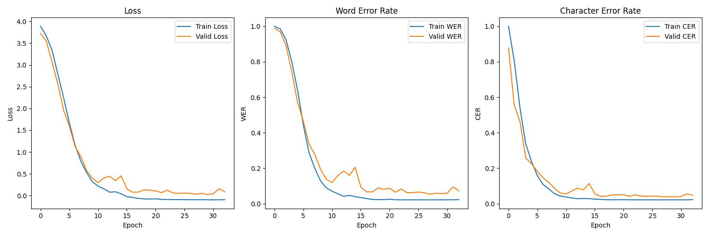

# Handwritten Character Recognition (CRNN + AFDM)

This project implements a **Handwritten Character Recognition System** using a **Convolutional Recurrent Neural Network (CRNN)** with an **Adversarial Feature Deformation Module (AFDM)**.  
It supports training from scratch, evaluation, and inference (single/batch images).  



---

## 📂 Project Structure
```
.
├── HandwrittenCharacterRecognitionModel.py   # Model definition + training pipeline
├── Recognition.py                            # Inference script (single & batch image recognition)
├── Helper.py                                 # Utility script for dataset preparation
├── training_curves.png                       # Training metrics visualization
└── README.md
```

---

## 🚀 Features
- **CRNN architecture** for sequence modeling of characters.  
- **AFDM module** for adversarial feature deformation (improves robustness).  
- **CTC loss** for sequence-to-sequence alignment.  
- **Custom dataset loader** with aspect ratio preservation & padding.  
- **Training utilities**: checkpoints, early stopping, resume training.  
- **Inference options**: single image or batch processing with confidence scores.  
- **Helper script** for splitting/moving random images into training/testing sets.  

---

## ⚙️ Installation
Clone the repository and install dependencies:
```bash
git clone https://github.com/your-username/handwritten-character-recognition.git
cd handwritten-character-recognition
pip install -r requirements.txt
```

**requirements.txt** (create this file if needed):
```
torch
torchvision
numpy
matplotlib
tqdm
scikit-learn
Pillow
editdistance
keyboard
```

---

## 📊 Dataset
The dataset should be organized as:
```
data/
 ├── CharacterA/
 │    ├── img1.png
 │    ├── img2.png
 │    ...
 ├── CharacterB/
 │    ├── img1.png
 │    ├── img2.png
 │    ...
```

To create a random train/test split, update paths in **Helper.py** and run:
```bash
python Helper.py
```

---

## 🏋️ Training
Run training with:
```bash
python HandwrittenCharacterRecognitionModel.py --data_dir ./data --epochs 100
```

Options:
- `--resume` → Resume from checkpoint  
- `--checkpoint best_model.pth` → Path to saved model  
- `--patience` → Early stopping patience  
- `--pretrain_iters` / `--afdm_init_iters` → Control pretraining and AFDM initialization  

---

## 🧪 Testing
After training, evaluate with:
```bash
python HandwrittenCharacterRecognitionModel.py --test --test_dir ./test_data
```

---

## 🔍 Inference
Use the **Recognition.py** script for recognition:

### Single Image
```bash
python Recognition.py --model best_model.pth --num_classes <NUM_CLASSES>
```
Then choose option **1** and provide image path.

### Batch of Images
Choose option **2** and provide a folder path.  

Output includes **top-3 predictions with confidence scores**.  

---

## 📈 Results
The model tracks **Loss, WER (Word Error Rate), and CER (Character Error Rate)** over training:  

- **WER (↓ better)** – measures incorrect words.  
- **CER (↓ better)** – measures incorrect characters.  

See `training_curves.png` for training/validation performance.

---

## ✨ Credits
Developed by **Group No. 6** as part of Handwritten Character Recognition project.  
